README.md still working in progress, there will be a final report here of the experiment, examples and dependencies. References would also be all added later on.

# Cifar-10 Dataset Classification with Vision Transformer

## Author
**Name:** Jeng-Chung, Lien 
**Email:** masa67890@gmail.com

## Table of Contents
temp

## Introduction
In 2017, when the paper “Attention is All You Need” was introduced, it became a dominant model structure and architecture in the natural language processing(NLP) domain. Due to the component of the multi-head self-attention, an attention mechanism, and the scalability ,the availability of parallel computation and the flexibility of the transformer model. Transformer models have become the state of art model in NLP. Vision Transformer, an image classification model using transformers is implemented in this project with tensorflow. Vision Transformer is a model created by the google research and brain team. Due to the expensive computation of the transformer model on images they introduced this model to make transformers possible on images, this has opened a new era on images rather than using convolution neural networks. Transformers is a new era of state of art models on multiple data types not limited on images. We will be using this self-implemented Vision Transformer from the original paper to perform some experiment on a small data set for demonstration, Cifar-10, an image classification data set. We then will discuss the components of the model, the hyperparameters, the scale of different data sizes and the inductive bias that was introduced in the paper.

## CIFAR-10 Dataset
The dataset to perform image classification here would be using the Cifar-10 dataset. The Cifar-10 dataset was collected by Alex Krizhevsky, Vinod Nair, and Geoffrey Hinton. These data are a tiny subset from the 80 million tiny image dataset, which has 10 labeled classes(airplane, automobile, bird, cat, deer, dog, frog, horse, ship, truck). There is no additional pre-processing that is needed on these data, they are all in consistent sizes of 32x32x3. What is done is only using min-max scaling to scale the pixels from the range of 0-255 to 0-1. Here the dataset consists of 60000 images in total, where the dataset is split into 50000 as the train set and 10000 as the test set. Where there are 5000 images per class in the train set and 1000 images per class in the test set. Below are the examples of 10 random images in each class.

**CIFAR-10 Dataset Figure:** 
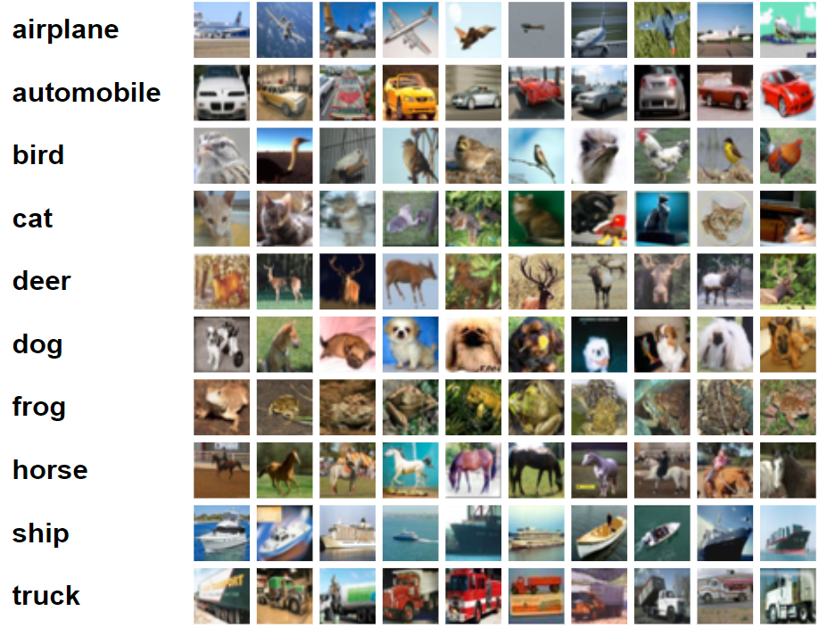

## Vision Transformer Model
Vision Transformer is an image classification model using transformer architecture, here we will be discussing each component and structure of the vision transformer. Below is the whole structure of the Vision Transformer from the original paper. We will separate this model into two parts for the ease of explanation of the model components. Where the two parts would be the 1. Image Patch + Position Embeddings to feed in the Vision Transformer and the 2. Vision Transformer structure itself.

**Vision Transformer Model Figure:** 
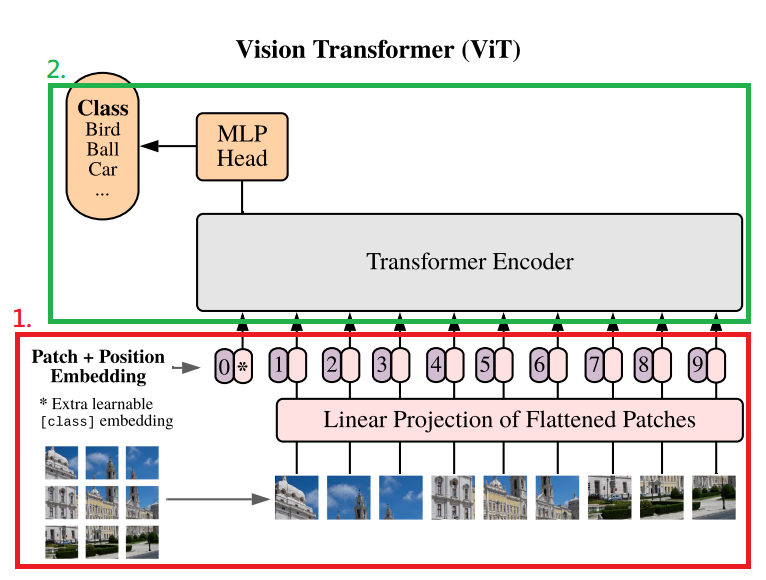

1. **Image Patch + Position Embeddings** 
For the Image Patch + Position Embeddings we will separate this part into four components for explanation. a. Patches of Images, b. Image Embeddings, c. Class Token, and d. Position Embeddings. The components are shown below.

     **Embeddings Components Figure:** 
    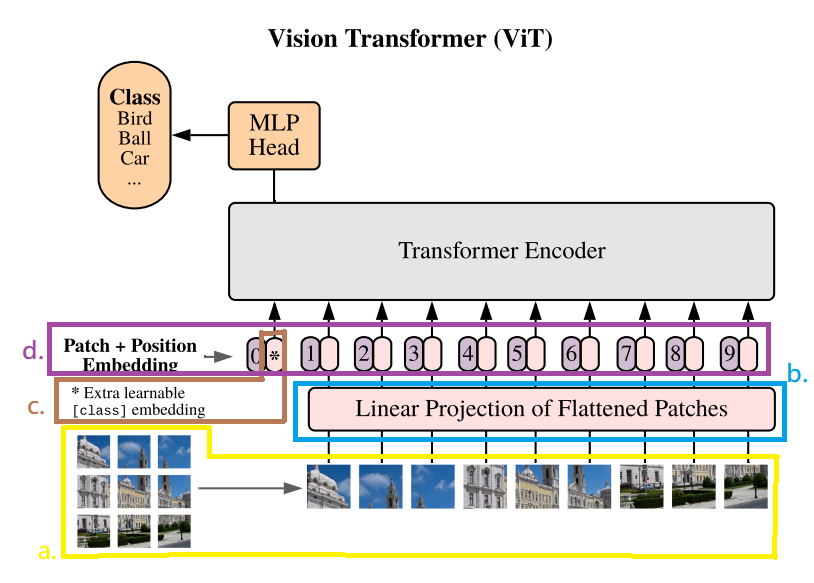
      
    1.a. **Patches of Images** 
    The patches of images are simply just splitting the images into patches of images. For example for a 16x16 image, if we want patches of size 4x4. We simply split the image into 4 patches of size 4x4 shown in the image below.

     **Patches Figure:** 
    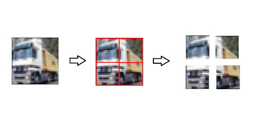
      
    1.b. **Image Embeddings** 
    For image embeddings we simply take the image patches from part 1.a. and pass each of the patches to the same linear layer, where the weights will all be the same when mapping each patch to vectors before updating the weights. This basically is creating a dense layer with linear activation for the model to learn itself of how it would like to map the set of patches from a given dataset to vector space. Basically a subset of pixels group in an image as a vector representation. This process is shown in the below image.

     **Image Embeddings Figure:** 
    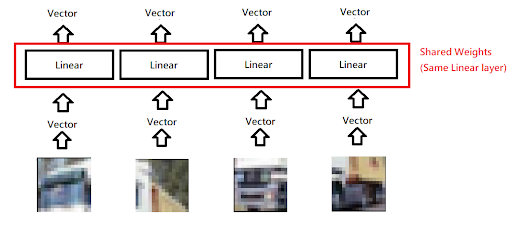
      
    1.c. **Class Token** 
    For the class token, it is a learnable vector that represents the whole image. As stated in the Vision Transformer paper, this is similar to the BERT’s class token. The usage for adding this additional class token is to not introduce any bias towards any output of the corresponding patches’ input. Since transformers would output the result with a specific input that views the correlation with other input. Here by creating an additional whole image vector representation to learn on its own and output a class representation vector at the output of the transformer. For a learnable class token it would be taking an item as a one hot vector through a dense layer with linear activation as the representation, shown in the image below.

     **Class Token Figure:** 
    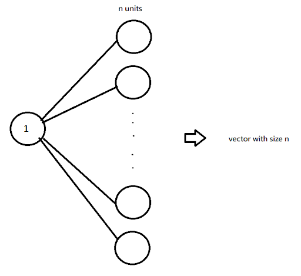
      
    For not introducing any bias towards the input of patches, below is a visual representation of how the transformer would output given inputs. If only using a single vector of the P1 output as the vector to input to the MLP head it would bias towards patch 1 of the image, hence taking Pn output as the vector to input to the MLP head would bias towards patch n. Therefore by creating an additional class token through the transformer output P0 as a whole image representation to input into the MLP head for classification.

     **Patch Bias Figure:** 
    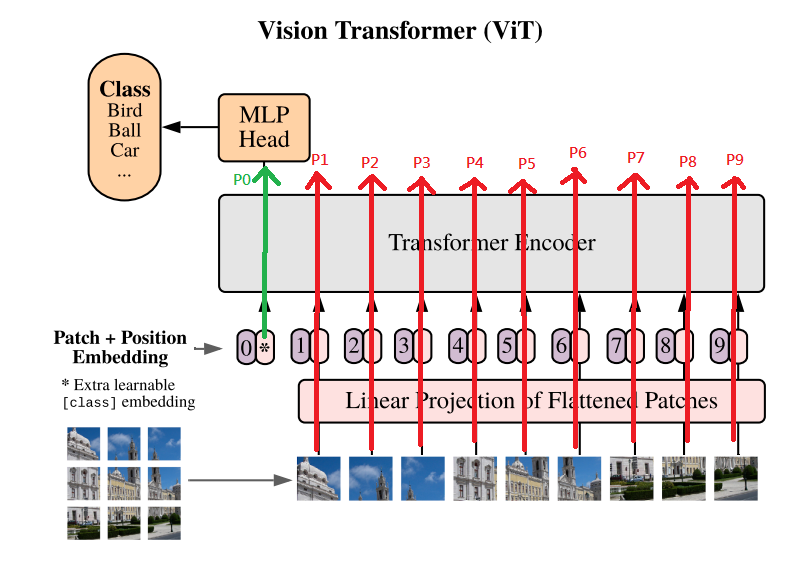
      
    1.d. **Position Embeddings** 
    Here for position embeddings, it would be a 1D rastar order learnable position embedding. As stated in the Vision Transformer paper also for the original transformer model, using no position embeddings it would just be a bag of patches or bag of words to the transformer. Since the transformer model itself in nature doesn’t recognize any position perspective, adding additional learnable position embeddings to the embeddings as an input would give the transformer model additional information of position to the data, this would boost the performance of the transformer model. Where in this case is different from the original transformer model where they use different frequencies of wave functions as positional representations, here we let the model learn the positional order itself. Basically, it would be using one-hot vector representations of p+1 positions passing through a dense layer with linear activation to get the positional embeddings, where there are p patches and 1 class token, the image shown below. From a high level, we could imagine this as a puzzle, where there are patches and the model would figure out how to construct these patches into a whole image. The reason for not using a 2D representation which in nature makes sense for 2D structure for images, is due to there is no boost in performance stated in the Vision Transformer paper.

     **1D Learnable Position Embeddings Figure:** 
    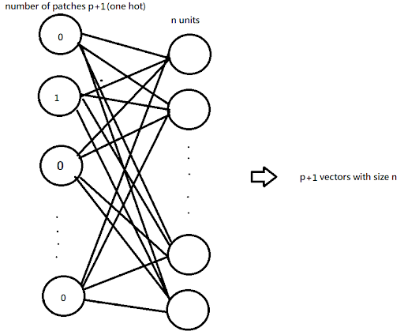
      
    For the whole process of part 1. to generate the image patch + position embeddings, taking all the vector representations of each patch of a single image as the image embeddings in 1.b(p vectors with size n), we concat this with the class token(single vector size n) to get a p+1 vector with size n. We then take this p+1 vector with size n and do addition with the position embeddings(p+1 vectors with size n) to get the final embeddings(p+1 vectors with size n), which are the patches of the image vector representation with positional information with an addition class token of the whole image representation. This process is shown in the image below. We then will take these final embeddings as the input to the transformer encoder.

     **Process Overview of Part 1 Figure:** 
    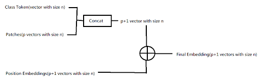
      

2. **Vision Transformer Structure** 
For the Vision Transformer Structure we will separate this part into two components for explanation. a. Transformer Encoder, and b. MLP Head. The components are shown below.

     **Vision Transformer Structure Figure:** 
    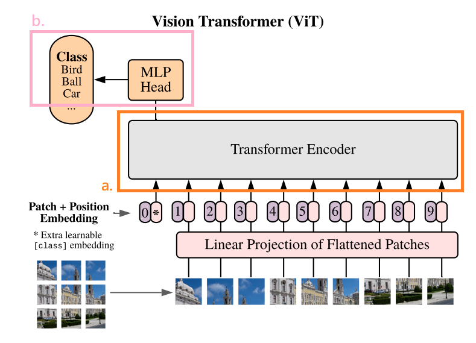
      
    2.a. **Transformer Encoder** 

     **Transformer Encoder Figure:** 
    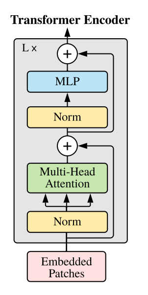
      

    * **Description:**
    The above image is the structure of the transformer encoder for vision transformer. Different from the encoder of the original transformer paper, they apply the normalization before each component. Hence the structure here is in the sequence of i. layer normalization(Norm), ii. multi-head attention, iii. layer normalization(Norm), and iv. multilayer perceptron(MLP). Where there are two small skip connections, the first one is taking the input of i. and adding it with the output of ii. to pass it as the input of iii. The second one is taking the input of iii. and adding it with the output of iv. as the output of the transformer encoder block. We could stack up these transformer encoder blocks to add the depth and complexity of the model, the Lx here means the parameter of the number of stacks of these transformer encoder blocks. To note that there are dropout layers in between components through the network.
    * **Components:**
        * **Multi-Head Attention:**
        This is the main component of the transformer model, an attention mechanism. From a high level perspective taking an image as an example, it is taking the image itself and searching on itself to see which parts are the important parts to focus and take account of the information, hence putting attention on specific parts of the image. For example, if there is a classification task of classifying human eye colors from a whole human face image, the attention would focus on the parts of the eye mainly.
          **Multi-Head Attention Figure:** 
        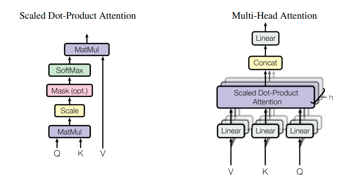
          
        Above is the structure of the Multi-Head Attention(Right.) and the structure of the Scaled Dot-Product in Multi-Head Attention(Left.). 
            * **Scaled Dot-Product Attention:**
            For the Scaled Dot-Product Attention, it is taking multiple vectors into a matrix as a query Q, multiple vectors into a matrix as key K and multiple vectors into a matrix as value V. It is basically the concept of taking a query to search on a key value pair. Here the QKV are all taken from the same input(known as self-attention) passing through different dense layers with linear activation, here the query is matmul with the key then scaled down with the value of the square root of the dimension of the key. We could ignore the Mask in this part since it is used in the decoder of the original transformer paper. This scaled down matrix is then passed through a softmax, in a form of softmax through each row, this forms a probability or a correlation matrix where the focus and attention occurs. This correlation matrix is then matmul with the value matrix to form the attention score matrix. The formula is shown below.              **Scaled Dot-Product Attention Formula Figure:** 
            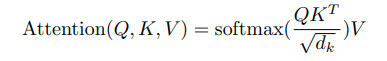
              
            * **Multi-Head Attention:**
            Multi-Head Attention: For multi-head attention, we are taking h different scaled dot-product attention where all of these h attention heads will have different dense layers with linear activation. The output of these attention heads are then concat together and passed through another dense layer with linear activation to reduce the dimension. From a high level perspective of what the multi-head attention is doing, we could look at the human eye color example previously. If we use two attention heads in the multi-head attention, it is possible that one attention would focus on the eyes in the image and the other attention would focus on the skin color of the image. Using multiple attentions means considering more different features and perspectives that have correlations to focus on and learn.
        * **Layer Normalization:**
        For layer normalization, different from batch normalization it doesn’t scale individual features through a batch distribution. It normalizes through a single sample with all of the different features.
        * **MLP:** 
        For the multilayer perceptron here it is simply using two dense layers with gaussian-error linear unit(GELU) activation.

     2.b. **MLP Head** 
    Here the MLP Head is taking only the output corresponding to the class token as input only to consider the whole image representation without any bias towards any of the patches. The components of the MLP Head are simply using a dense layer with GELU activation then through a dense layer with sigmoid or softmax activation for classification.

## Experiment
Here we perform an experiment by using different numbers of patches and projection dimensions to see how well the vision transformer performs. Different from the experiment in the vision transformer paper, where they use really large data sets like imagenet, imagenet-21k, and their own extremely large dataset JFT-300M. They used these datasets to perform pretrain on the model and fine-tune on downstream tasks. Where they got better results on vision transformers when pretrain on a really large dataset, but when pretrained on a small dataset CNN would perform better. It is also stated that larger models of their vision transformer(adding model complexity) performs even better. Here due to hardware, money and time cost limitation. A fairly low number of parameters and a small dataset would be performed on this self-implemented vision transformer. Here we directly train multiple vision transformers with different hyperparameters on the CIFAR-10 dataset and evaluate it on the test set.

Here we used some of the same settings on all the vision transformer models structure and training parameters shown below:
* **Attention heads**: 8 attention heads for the multi-head attention
* **Transformer Encoder stacks**: 6 stacks
* **Dropout Probability**: 0.1 through the whole network
* **Optimizer**: Adam decouple weight decay with 10^-5 weight decay
* **Learning mode**: A linear learning rate decay(details in appendix)
* **Batch size**: Using batch size of 20 to train
* **Epochs**: Using 50 epochs to train
* **Loss Function**: Sparse Categorical Cross Entropy
* **Evaluation Metric**: Top-1 Accuracy

The original vision transformer paper increased the model complexity to improve the performance, by increasing the number of units of the neural network(increasing the units of the dense layers) and minimizing the image size of the patches, hence increasing the number of patches. Here we would like to experiment on how the number of units(the projection dimension) and number of patches would affect the performance trained on this CIFAR-10 small dataset. However, the number of patches here is different from just minimizing the image size of the patches. Since the assumption of the vision transformer is taking a group of pixel representations and mapping it to a vector space, it would make sense by increasing the combinations of groups of pixels for the vision transformer to increase the performance, rather than just minimizing the pixels as a group to increase the performance. However, this is on the view of the local dense layers when embedding the information to vector space. From the view of the global multi-head attention, view through different parts of the image and finding where to focus on, by minimizing the pixels as a group means that the attention could focus on smaller parts of the image and by increasing the combination of the pixel group rather than minimizing the patch size(multiple patches with overlapping areas on the image) means more different parts of the image to focus on. Both should increase the performance and wouldn’t have much difference. However, for individual pixels as it ownself and performed on transformers would be the ideal situation, since the transformer could view every detail of the pixels and choose to focus on the most detailed parts of the image, but it is possible that with this structure there is more data that is needed to increase performance.

The patches are seperated in two settings, for the first setting we use a 4x4 patch size on the 32x32 image, where there is no overlapping on the image to generate patches. For the second setting we use the same 4x4 patch size, but with a stride of 2 pixels on the 32x32 image where there is overlapping to generate patches. This is shown in the image below, where on the left is the first setting 64 patches in total, and on the right is the second setting 225 patches in total.

**Two Patch Settings Figure:** 
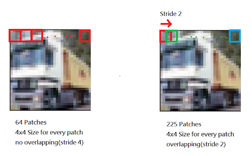

We would also like to see if the projection dimension of the vector of the patches and the number of units would affect when increasing the number of patches. Here we use different numbers of projection dimensions, 16, 32, 64 , 128 and 256. By training multiple vision transformer models with these settings, we got the results shown in the table below, where the model name is in the format of ViT_{Patch_num}_{Projection_Dimension}.

|  **Model** | **Patches** | **Project Dimension** | **Accuracy(%)** |  **Model**  | **Patches** | **Project Dimension** | **Accuracy(%)** |
|:----------:|:-----------:|:---------------------:|:---------------:|:-----------:|:-----------:|:---------------------:|:---------------:|
|  ViT_64_16 |      64     |           16          |      61.40      |  ViT_225_16 |     225     |           16          |      66.41      |
|  ViT_64_32 |      64     |           32          |      66.21      |  ViT_225_32 |     225     |           32          |      68.78      |
|  ViT_64_64 |      64     |           64          |      69.76      |  ViT_225_64 |     225     |           64          |      73.57      |
| ViT_64_128 |      64     |          128          |      69.67      | ViT_225_128 |     225     |          128          |      73.07      |
| ViT_64_256 |      64     |          256          |      70.55      | ViT_225_256 |     225     |          256          |      74.01      |

We could get the figure below, by plotting the table above.

**Experiment Result Figure:** 
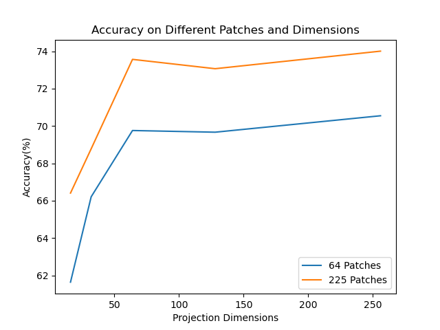

By looking at the figure above, we could see that no matter the number of patches, by increasing the projection dimension the accuracy would increase to some extent and start to flatten out. And interesting to see that no matter the projection dimension, by increasing the number of patches from 64 to 225 there is a 3-5% boost on accuracy. It is possible that by increasing the number of patches the accuracy would increase even more, however due to hardware limitations this wouldn’t be tested. It is also possible that the accuracy would just flatten out with even more patches or start to fall off and need more data to boost the performance.

## Conclusion
In this project, we explained the vision transformer model. The components of the model, mainly the power of the multi-head attention. We mention parts of the experiment that was performed in the original vision transformer paper and the performance of the vision transformer, where the vision transformer mainly performs well on large scale data and CNNs would perform better on small sets of data than transformers. This is mentioned in the paper that vision transformers have less image specific inductive bias, where the vision transformer looks at groups of the images(groups of the pixels are still some kind of bias structure here) and chooses the parts to focus on the view of the whole image(the multi-head attention viewing the whole image globally), and CNNs have a structure of assumption of the image have a 2D neighborhood structure that has the highest correlation between neighbors with the view of looking at this locally through each of the model’s layers. Here we experimented by tuning the number of patches in a different way, using the same patch size but with overlapping parts of the image with different numbers of projection dimension. It is interesting to see that increasing the number of patches this way increases the model performance without the effect on the number of projection dimensions. It would be interesting to see if there are some other ways to perform transformers on images by looking at every individual pixel without the effect on expensive computations and see how it would perform. Furthermore, it would be more amazing if we could boost the performance without pretraining on huge datasets with transformers, since it is a more general model that would need large data distributions to perform well. This is just the start of this project to test out the implementations and how the transformer model structure would transform into more different structures.

## Future Work
**Perceiver**:
Due to the expensive computation of the self-attention, where it is around the time-complexity of O(n^2*d) where the n would be the number of patches here and the d would be the projection dimension. In this project we increase the patches and projection dimension to boost the performance, however for the patches it is in O(n^2) of the time-complexity, which would be really expensive to compute if we increase the number of patches. Since we would want to experiment on every individual pixel the number of patches for a 32x32 image would be 1024, where the n would be 1024 which 1024^2 would be really expensive for low cost hardware. Here for future work on how the performance would affect by using every individual pixel, we would like to try a model called Perceiver. This is where they introduce cross-attention, by adding an additional latent vector on the query to reduce the dimension of the input while looking at every individual part of the input. Then used this reduced dimension representation to perform self-attention.

**Sharpness-Aware Minimization**:
Since transformers are a more general model, it needs large amounts of data, by looking at enough data distribution to perform well. Here we experimented with data training on a small dataset. Although data augmentation is a solution to increase the data size, it requires some expertise on such a domain to tweak the data, if done wrong it would perform even worse. Here we would like to try some kind of optimization algorithm called Sharpness-Aware Minimization, where it could smooth out the convergence error of the model(from a intuition perspective the local minima would be sharp, where the slopes would be really steep also for the global minima the range would be small for these minima to go trough and would easily be stuck in the local minima or miss out global minima), hence it smooths out the slopes and some how could let models converges even better. This could perform on small datasets where it would boost the performance. It is possible that it smooths out the convergence on small data distributions to somehow find the correct representation of large data distribution with small data distributions. To note there is a paper that has experimented on such a method.

## Appendix
For the linear learning rate decay, it is taking an initial learning rate at the first epoch and minimizing it by a constant each epoch. For both the 64 and 225 patches of the vision transformer models starting from the projection dimension of 16 to 256, the initial learning rates used here are 0.002, 0.001, 0.0005, 0.00025, and 0.000125. For the decay rates of these initial learning rates are 0.0000399, 0.0000199, 0.0000099, 0.0000049, and 0.00000249.

## Reference
[1] A. Dosovitskiy, L. Beyer, A. Kolesnikov, D. Weissenborn, X. Zhai, T. Unterthiner, M. Dehghani, M. Minderer, G. Heigold, S. Gelly, J. Uszkoreit, and N. Houlsby, “An Image is Worth 16x16 Words: Transformers for Image Recognition at Scale,” Jun. 2021. [Online]. Available: [https://arxiv.org/abs/2010.11929](https://arxiv.org/abs/2010.11929)

## Other Projects
1. ISICs Dataset Segmentation with Improved UNet. [Github Link](https://github.com/shakes76/PatternFlow/tree/topic-recognition/recognition/Segmentation-ISICs-ImprovedUnet-s4623205)